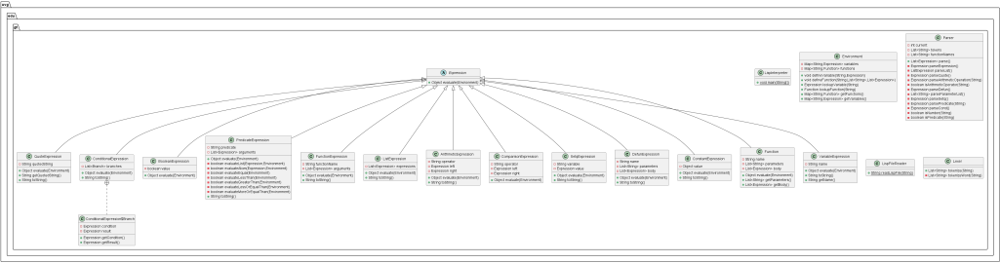
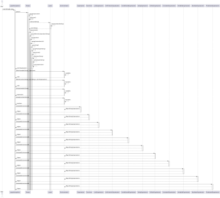

# **<u>Proyecto Fase#2</u>**

Jonathan Zacarías 231104

Diego López 23242

June Herrera 231038

**<u>Análisis</u>:**

- ¿Qué acciones debe poder hacer su programa?

  - >Tokenización: El programa debe ser capaz de tomar un archivo de
    > entrada en un formato Lisplike y dividir su contenido en tokens
    > significativos, como paréntesis, palabras clave, operadores y
    > valores.

  - >Parseo: Debe convertir estos tokens en estructuras de datos
    > interpretables que representen expresiones Lisp, como expresiones
    > aritméticas, expresiones booleanas, llamadas de función, etc.

  - >Evaluación: El programa debe ser capaz de evaluar estas expresiones
    > en un entorno dado, teniendo en cuenta las variables definidas y
    > las funciones disponibles.

  - >Interacción con el Entorno: Debe permitir la definición de variables
    > y funciones dentro de un entorno de ejecución, así como la
    > recuperación de valores de variables y funciones.

  - >Manejo de Errores: Debe manejar errores como divisiones por cero,
    > referencias a variables no definidas, llamadas a funciones no
    > definidas, etc.

- ¿Con qué datos va a trabajar?

  - >Tokens: Secuencias de caracteres significativos identificadas
    > durante la tokenización, como paréntesis, operadores, palabras
    > clave y valores.

  - >Expresiones: Representaciones estructuradas de expresiones Lisp,
    > como árboles de expresiones aritméticas, expresiones booleanas,
    > llamadas de función, etc.

  - >Variables: Nombres de variables y sus valores asociados en un
    > entorno de ejecución.

  - >Funciones: Nombres de funciones y sus definiciones, incluidos los
    > parámetros y el cuerpo de la función, en un entorno de ejecución.

**<u>Descripción de clases:Métodos y Atributos de clases:</u>**

**Clases:**

- >**ArithmeticExpression:** Representa una expresión aritmética (+, -,
  > \*, /).

- >**BooleanExpression:** Almacena un valor booleano.

- >**ComparisonExpression:** Compara dos expresiones (\<, \>, \<=, \>=,
  > =).

- >**ConditionalExpression:** Evalúa una serie de ramas condicionales.

- >**ConstantExpression:** Almacena un valor constante.

- >**DefunExpression:** Define una nueva función.

- >**FunctionExpression:** Llama a una función con argumentos.

- >**ListExpression:** Evalúa una lista de expresiones.

- >**VariableExpression:** Obtiene el valor de una variable.

- >**SetqExpression:** Asigna un valor a una variable.

- >**QuoteExpression:** Devuelve un string sin procesar.

- >**PredicateExpression:** Evalúa un predicado con argumentos.

**Interfaces:**

- >**Expression:** Define el método evaluate(Environment environment).

- >**Function:** Define el método evaluate(Environment environment).

**Otras Clases:**

- >**Environment:** Almacena variables y funciones.

- >**Lexer:** Convierte una cadena en tokens.

- >**LispFileReader:** Lee un archivo Lisp y devuelve su contenido.

- >**Parser:** Analiza tokens y devuelve expresiones.

**Métodos:**

- >**evaluate(Environment environment):** Evalúa una expresión en un
  > entorno.

- >**toString():** Devuelve una representación en cadena de una
  > expresión.

**Atributos:**

- >**operator:** Operador aritmético (+, -, \*, /).

- >**left:** Expresión izquierda.

- >**right:** Expresión derecha.

- >**value:** Valor booleano.

- >**branches:** Lista de ramas condicionales.

- >**name:** Nombre de la función o variable.

- >**parameters:** Lista de parámetros de una función.

- >**body:** Lista de expresiones que conforman el cuerpo de una función.

- >**expressions:** Lista de expresiones en una lista.

- >**quotedString:** String citado.

- >**predicate:** Nombre del predicado.

- >**arguments:** Lista de argumentos del predicado.

**Funciones:**

- >**main(String\[\] args):** Función principal del intérprete Lisp.

- >**tokenize(String input):** Divide una cadena en tokens.

- >**readLispFile(String filePath):** Lee un archivo Lisp y devuelve su
  > contenido.

- >**parse():** Analiza tokens y devuelve una lista de expresiones.

- >**parseExpression():** Analiza y devuelve una expresión según el token
  > actual.

- >**parseList():** Analiza y devuelve una expresión de lista.

- >**parseQuote():** Analiza y devuelve una expresión de cita.

- >**parseArithmeticOperation(String operator):** Analiza y devuelve una
  > expresión de operación aritmética.

- >**isArithmeticOperator(String token):** Verifica si un token es un
  > operador aritmético.

- >**parseDefun():** Analiza y devuelve una expresión de definición de
  > función.

- >**parseParameterList():** Analiza y devuelve una lista de parámetros
  > de función.

- >**parseSetq():** Analiza y devuelve una expresión de asignación.

- >**parsePredicate(String token):** Analiza y devuelve una expresión de
  > predicado.

- >**parseCond():** Analiza y devuelve una expresión condicional.

- >**evaluateAtom(Expression exp, Environment environment):** Evalúa si
  > una expresión es un átomo.

- >**evaluateList(Expression exp, Environment environment):** Evalúa si
  > una expresión es una lista.

- >**evaluateEquality(Expression exp1, Expression exp2, Environment
  > environment):** Evalúa si dos expresiones son iguales.

- >**evaluateComparison(String operator, Expression exp1, Expression
  > exp2, Environment environment):** Evalúa una comparación entre dos
  > expresiones.

- >**evaluateAnd(List\<Expression\> expressions, Environment
  > environment):** Evalúa una conjunción de expresiones.

- >**evaluateOr(List\<Expression\> expressions, Environment
  > environment):** Evalúa una disyunción de expresiones.

**<u>Estructuras del Java Collections Framework</u>**

Para este proyecto se implementaron diferentes estructuras, ya que se
necesitaban tanto para almacenar como para analizar el orden de los
tokens. Las estructuras utilizadas y las razones por las que se
eligieron estas son:

- >HashMap: La clase HashMap se utiliza en la clase Environment para
  > almacenar las variables y las funciones definidas en el entorno
  > Lisp. Se utiliza porque proporciona un acceso rápido a los elementos
  > a través de claves y permite asociar cada variable o función con su
  > nombre de manera eficiente. Esto es útil para la búsqueda y
  > definición de variables y funciones durante la evaluación de las
  > expresiones Lisp.

- >ArrayList: La clase ArrayList se utiliza en varias partes del código
  > para almacenar listas de expresiones y tokens. Por ejemplo, en la
  > clase Parser, se utiliza un ArrayList para almacenar la lista de
  > expresiones Lisp después de analizar los tokens. Se elige esta
  > estructura porque proporciona un acceso rápido a los elementos
  > mediante índices y permite almacenar una colección dinámica de
  > elementos.

- >List: La interfaz List se utiliza en muchas clases y métodos para
  > representar listas de elementos. Se prefiere el uso de la interfaz
  > List sobre las implementaciones concretas como ArrayList porque
  > proporciona flexibilidad en el uso de diferentes implementaciones de
  > listas, lo que facilita el cambio de implementaciones si es
  > necesario sin afectar el resto del código. Esto sigue el principio
  > de programar con interfaces en lugar de implementaciones concretas.

**<u>UML</u>**

Diagram de clases

Diagram de secuencias

**Video**

[<u>https://youtu.be/WJGV8fLIy3A</u>](https://youtu.be/WJGV8fLIy3A)
